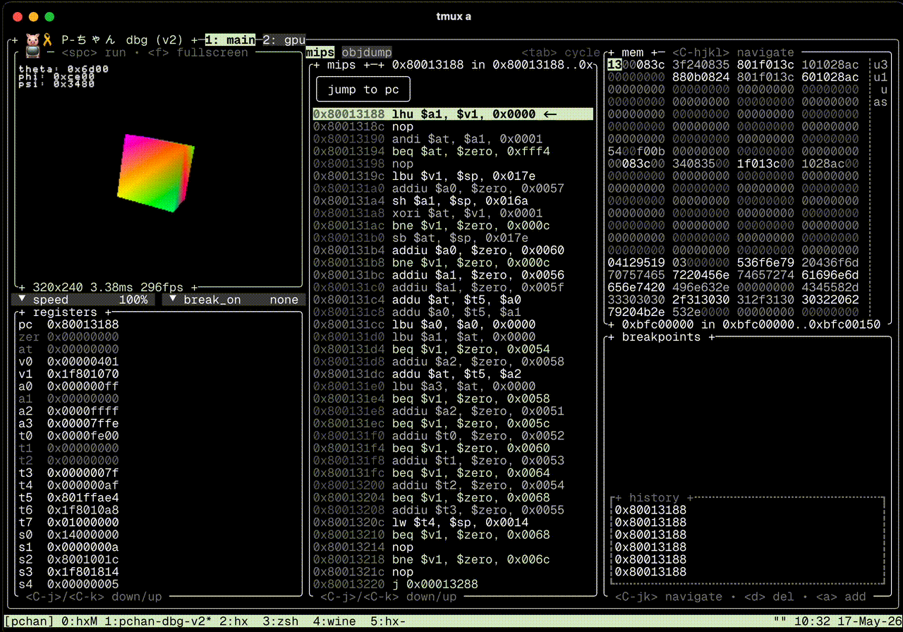

# P-chan 🐷🎀
*Pーちゃん* 

WIP high performance PlayStation 1 emulator

<div align="center">
  </img>
</div>

## Build

> By default P-Chan compiles with opt-level=1. If you want faster compile times, pass `-C opt-level=0` to `RUSTFLAGS`

For the tui debugger:

```sh
cargo run -p pchan-dbg-v2
# or to run an executable
cargo run -p pchan-dbg-v2 -- game.exe
```

## Status

The current emulator includes the dynarec cpu and hardware rasterizer. Though
not complete yet, they are enough to render the bios splash screen accurately.

- [x] memory
  - [x] fastmem (bios and ram)
  - [x] io interface
- [x] dynarec (dynasm-rs based, 95% completed, very few rare instructions left)
  - [x] removed cranelift (way too slow)
  - [x] aarch64
  - [ ] x86_64 (later)
  - [ ] risc-v (later)
- [ ] gpu
  - [x] guest emulation
    - [x] basic functionality (vram, dma, gpu commands, etc)
    - [x] timing
    - [x] draw calls
  - [ ] `WIP` hardware (wgpu) renderer
    - [x] polygons (tris and quads)
    - [x] rects (sprites)
    - [ ] lines
  - [ ] software renderer (not started)
- [ ] cdrom
  - [x] basic registers
  - [x] fifo
  - [ ] commands
  - [ ] cd-xa (music)
- [ ] spu
  - [x] basic spu & gauss interpolation
  - [x] audio thread 
  - [x] volume
  - [x] adsr envelope
  - [ ] reverb
  - [ ] noise generator
- [ ] sio
  - [ ] input
    - [ ] digital joypad
    - [ ] analog joypad
  - [ ] memcards

## Milestones

- [x] reset vector
- [x] tty output
- [ ] psxtest cpu
- [x] shell
- [ ] in-game

### Time frame

about 10 years 

## Performance

Initially this section contained a lot more useless speculation, so I chose to
remove it. Instead, here's some actual meaningful metrics: pchan runs a bios
shell frame in 3ms. This would be more than fast enough for gameplay, but the
goal is ~0.1ms (Duckstation runs it in ~0.16ms). There is a long way to go,
but I already know which parts are stupid slow and how to fix them. However, my
initial focus for now is on features and correctness.

A goal of this project is to make a very accurate and fast dynarec, such that an
interpreter is not needed. This might be impossible and/or it might make P-chan
quite cycle-inaccurate. The reason behind this decision is that, I really cannot
be assed to code an interpreter. No interpreter makes debugging difficult, as
such, much <3 to the devs of PCSX-Redux, which I am using for cross comparison.

## On AI Code

**No llm generated code** exists in **any** of the `pchan-*` crates (so all
crates in this repo). I do not condone the creation of machine generated slop.
Such workflows might work for uninspired react copy and paste dashboards,
but emulators require a holistic knowledge of hardware and implementation.
Some dependencies might include llm generated code (trust me I wish I could
go full schizo and remove them, but that isn't really practical sadly). Such
dependencies are usually limited to non core crates (so things outside of
`pchan-emu`, `pchan-gpu`, `pchan-audio` etc.).

As such, any hallucinated code came straight from my human, tired brain :)
